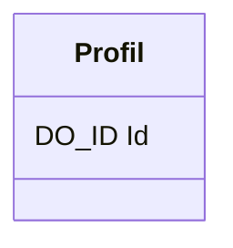


# Securite

## Diagramme de classe

## Schéma

### Profil
_Profil des utilisateurs_
| Name | Comment  | Domain | Required |
| --- | --- | --- | --- |
| **Id** | **Id technique** | **DO_ID** | :heavy_check_mark: |

