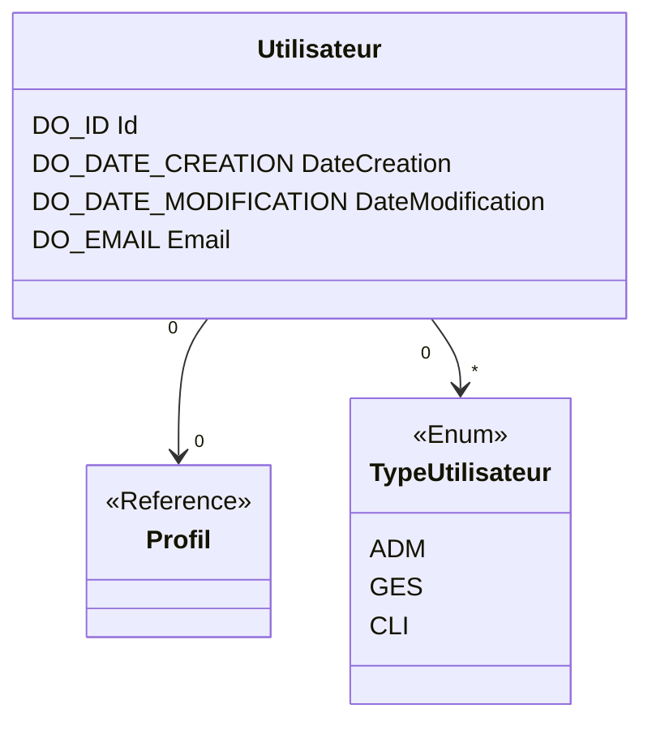


# Utilisateur

## Diagramme de classe

## Schéma

### Utilisateur
_Utilisateur de l'application_
| Name | Comment  | Domain | Required |
| --- | --- | --- | --- |
| **Id** | **Id technique** | **DO_ID** | :heavy_check_mark: |
| _ProfilId_ | _Liste des profils_ | _DO_ID_ | |
| _TypeUtilisateurCode_ | _Type d'utilisateur_ | _DO_CODE_ | |
| DateCreation | Date de création de la voiture | DO_DATE_CREATION | |
| DateModification | Date de création de la voiture | DO_DATE_MODIFICATION | |
| Email | Email de l'utilisateur | DO_EMAIL | |

#### Contraintes d'unicité
>    Id (Id technique)

### TypeUtilisateur
_Type d'utilisateur_
| Name | Comment  | Domain | Required |
| --- | --- | --- | --- |
| **Code** | **Code du type d'utilisateur** | **DO_CODE** | :heavy_check_mark: |
| Libelle | Libellé du type d'utilisateur | DO_LIBELLE | :heavy_check_mark:|

