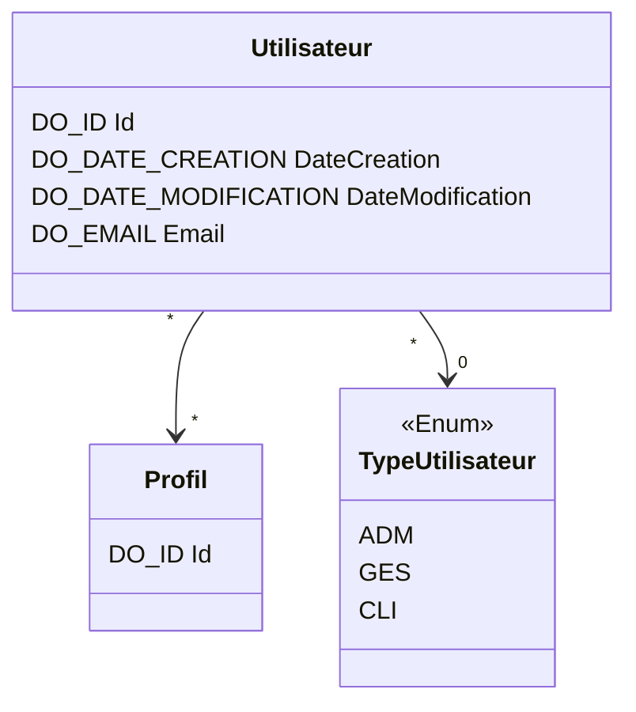


# Documentation technique

# Diagramme de classe

## Securite

### Profil
_Profil des utilisateurs_
| Name | Comment  | Domain |
| --- | --- | --- |
| **Id** | **Id technique** | **DO_ID** |

## Utilisateur

### Utilisateur
_Utilisateur de l'application_
| Name | Comment  | Domain |
| --- | --- | --- |
| **Id** | **Id technique** | **DO_ID** |
| _ProfilId_ | _Liste des profils_ | _DO_ID_ |
| _TypeUtilisateurCode_ | _Type d'utilisateur_ | _DO_CODE_ |
| DateCreation | Date de création de la voiture | DO_DATE_CREATION |
| DateModification | Date de création de la voiture | DO_DATE_MODIFICATION |
| Email | Email de l'utilisateur | DO_EMAIL |

#### Contraintes d'unicité
>    Id (Id technique)

### TypeUtilisateur
_Type d'utilisateur_
| Name | Comment  | Domain |
| --- | --- | --- |
| **Code** | **Code du type d'utilisateur** | **DO_CODE** |
| Libelle | Libellé du type d'utilisateur | :heavy_check_mark: |
