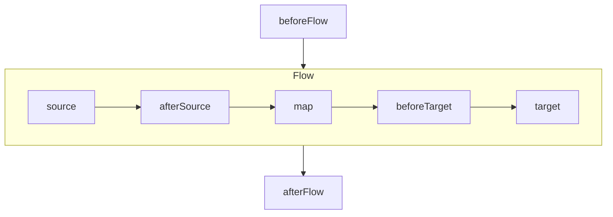

# Flux de données (BETA)

Les `dataFlow` sont des objets qui représentent des flux de données entre une ou plusieurs sources, et une destination unique.

Ces flux s'appuient sur la modélisation des objets (`class`), et de leurs différentes transformations (`mappers`) possibles. Ils permettent aux générateurs (`JPA` et `C#`) de générer du code permettant d'extraire des données des sources, de les transformer, et de les sauvegarder dans la destination.

Exemple :

```yaml
dataFlow:
  name: ImportInseeCommune  # Nom du flux de données
  type: replace             # Type de flux : merge, replace,  insert ou merge-disable
  target: dataSource        # Nom de la source de données de destination
  class: CommuneInsee       # Classe de l'objet à insérer dans la destination
  sources:                  # Liste des sources de données
    - source: rddDataSource # Nom de la source de données
      class: Commune        # Classe de l'objet récupéré dans cette source
      mode: queryAll        # Requête pour récupérer les données (queryAll ou partial)
```

## Types de flux

Le type de flux définit le comportement attendu vis-à-vis du chargement  la **destination**. Lorsque les données chargées doivent être sauvegardées en base, plusieurs options peuvent être envisagées.

### Insert

Le flux de données doit insérer les éléments provenant de la source sans se préoccuper des données existantes.

### Merge

Le flux de données doit insérer les éléments provenant de la source qui ne sont pas déjà existant, et mettre à jour les éléments déjà existants

### Replace

Le flux de données doit supprimer tous les éléments déjà existants, puis insérer les éléments provenant de la source.

### Merge-disable

Le comportement est le même que pour les flux de type merge, mais flux de données doit également effectuer une suppression logique (passer la propriété définie dans `activeProperty` à `false`) de tous les éléments qui ne font pas l'objet d'une mise à jour.

## Sources

Une dataSource abstraction capable de fournir un ensemble de données typées. Cela peut-être une base de données, mais aussi une API, ou un fichier csv...

Dans la définition d'un flux, la source est la combinaison d'une référence à une `dataSource` et d'une `class` définir dans le modèle.

Lorsque plusieurs sources sont définies, on considère que la première est celle qui sera transformée pour atteindre la destination. Il doit donc exister un mapper entre la première source, et la destination (obligatoirement un mapper `from`). Les autres sources doivent, elles, **compléter** la première source de données. Elles doivent donc définir un mapper `to` vers la classe de la première `dataSource`.

### Mode `queryAll`

Ce mode de `source` indique que le flux récupère **toutes** les données du type `class` que la `dataSource` peut fournir.

### Mode `partial`

Ce mode de `source` indique que l'utilisateur définira lui même la portion des données du type `class` que la `dataSource` devra fournir.

## Hooks

Pour rendre les flux de données plus personnalisés, il est possible de définir des `hooks`. Il s'agit de point de customisation qui seront placés dans le code généré, afin que l'utilisateur détermine certaines actions ou transformations à effectuer.

Exemple :

```yaml
dataFlow:
  name: ImportUtilisateurs
  target: dataSource
  class: Utilisateur
  type: replace
  sources:
    - source: dataSourceHistorique
      class: UtilisateurHistorique
      mode: queryAll
  dependsOn:
    - ProcessAdresses
  hooks:
    - beforeFlow
    - afterSource
    - map
    - beforeTarget
    - afterFlow
```



### Avant le flux : `beforeFlow`

Ce hook permet de déclencher une **action** avant le démarrage du flux de données. Il peut y en avoir plusieurs. Il ne prend aucune entrée et n'a aucune sortie.

### Après le chargement : `afterSource`

Ce hook permet de **transformer** les données récupérées de la source avant l'appel du `mapper`. Il peut y en avoir plusieurs. Il prend en entrée les données chargées, et renvoie des données du même type.

### Transormation : `map`

Ce hook permet de **transformer** les données récupérées de la source à la place du `mapper`. Il remplace l'étape de mapping par défaut. Il prend en entrée les données chargées, et renvoie des données du type de la destination. Il ne peut être ajouté qu'une seule fois.

### Avant l'insertion : `beforeTarget`

Ce hook permet de **transformer** les données mappées après l'appel du `mapper`. Il peut y en avoir plusieurs. Il prend en entrée les données mappées du type de la destination, et renvoie des données du même type.

### Après le flux : `afterFlow`

Ce hook permet de déclencher une **action** après la fin de l'exécution du flux de données. Il peut y en avoir plusieurs. Il ne prend aucune entrée et n'a aucune sortie.
