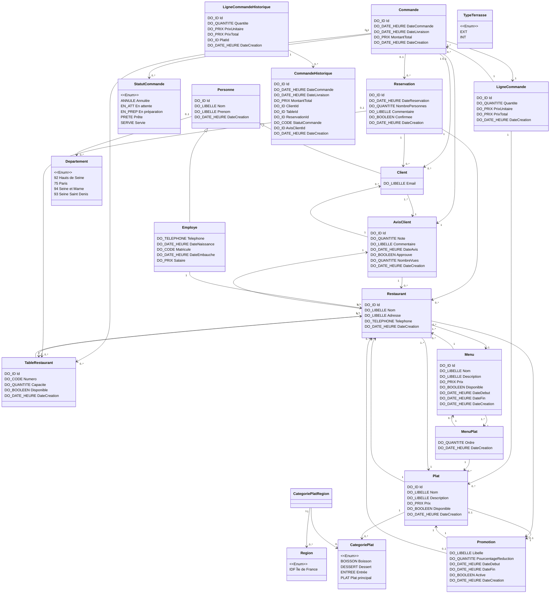

# Diagramme du module Restaurant

```mermaid
classDiagram
%% Commande d'un client
class Commande{
 DO_ID Id
 DO_DATE_HEURE DateCommande
 DO_DATE_HEURE DateLivraison
 DO_PRIX MontantTotal
 DO_DATE_HEURE DateCreation
}
Commande "1" --> "0..*" Client
Commande "0..1" --> "0..*" TableRestaurant
Commande "0..1" --> "0..*" Reservation
Commande "1" --> "0..*" StatutCommande
Commande "0..1" --> "1" AvisClient
Commande "1..*" --> "1" LigneCommande
%% Commande pour historique avec préservation des clés primaires
class CommandeHistorique{
 DO_ID Id
 DO_DATE_HEURE DateCommande
 DO_DATE_HEURE DateLivraison
 DO_PRIX MontantTotal
 DO_ID ClientId
 DO_ID TableId
 DO_ID ReservationId
 DO_CODE StatutCommande
 DO_ID AvisClientId
 DO_DATE_HEURE DateCreation
}
%% Ligne d'une commande
class LigneCommande{
 DO_ID Id
 DO_QUANTITE Quantite
 DO_PRIX PrixUnitaire
 DO_PRIX PrixTotal
 DO_DATE_HEURE DateCreation
}
LigneCommande "1" --> "0..*" Commande
LigneCommande "1" --> "0..*" Plat
%% Ligne de commande pour historique avec préservation des clés primaires
class LigneCommandeHistorique{
 DO_ID Id
 DO_QUANTITE Quantite
 DO_PRIX PrixUnitaire
 DO_PRIX PrixTotal
 DO_ID PlatId
 DO_DATE_HEURE DateCreation
}
LigneCommandeHistorique "1" --> "0..*" CommandeHistorique
%% Réservation d'une table
class Reservation{
 DO_ID Id
 DO_DATE_HEURE DateReservation
 DO_QUANTITE NombrePersonnes
 DO_LIBELLE Commentaire
 DO_BOOLEEN Confirmee
 DO_DATE_HEURE DateCreation
}
Reservation "1" --> "0..*" Client
Reservation "0..1" --> "0..*" TableRestaurant
Reservation "1" --> "0..*" Restaurant
%% Menu du restaurant
class Menu{
 DO_ID Id
 DO_LIBELLE Nom
 DO_LIBELLE Description
 DO_PRIX Prix
 DO_BOOLEEN Disponible
 DO_DATE_HEURE DateDebut
 DO_DATE_HEURE DateFin
 DO_DATE_HEURE DateCreation
}
Menu "1" --> "0..*" Restaurant
Menu "1..*" --> "1" MenuPlat
%% Plat dans un menu
class MenuPlat{
 DO_QUANTITE Ordre
 DO_DATE_HEURE DateCreation
}
MenuPlat "1" --> "0..*" Menu
MenuPlat "1" --> "0..*" Plat
%% Plat du menu
class Plat{
 DO_ID Id
 DO_LIBELLE Nom
 DO_LIBELLE Description
 DO_PRIX Prix
 DO_BOOLEEN Disponible
 DO_DATE_HEURE DateCreation
}
Plat "1" --> "0..*" CategoriePlat
Plat "1" --> "0..*" Restaurant
Plat "0..1" --> "1" Promotion
%% Promotion sur un plat
class Promotion{
 DO_LIBELLE Libelle
 DO_QUANTITE PourcentageReduction
 DO_DATE_HEURE DateDebut
 DO_DATE_HEURE DateFin
 DO_BOOLEEN Active
 DO_DATE_HEURE DateCreation
}
Promotion "1" --> "1" Plat
Promotion "0..1" --> "0..*" Restaurant
%% Avis d'un client sur un restaurant
class AvisClient{
 DO_ID Id
 DO_QUANTITE Note
 DO_LIBELLE Commentaire
 DO_DATE_HEURE DateAvis
 DO_BOOLEEN Approuve
 DO_QUANTITE NombreVues
 DO_DATE_HEURE DateCreation
}
AvisClient "1" --> "0..*" Client
AvisClient "1" --> "0..*" Restaurant
%% Client du restaurant
class Client{
 DO_LIBELLE Email
}
Client "1..*" --> "1" AvisClient
%% Employé du restaurant
class Employe{
 DO_TELEPHONE Telephone
 DO_DATE_HEURE DateNaissance
 DO_CODE Matricule
 DO_DATE_HEURE DateEmbauche
 DO_PRIX Salaire
}
Employe "1" --> "0..*" Restaurant
%% Classe de base représentant une personne
class Personne{
 DO_ID Id
 DO_LIBELLE Nom
 DO_LIBELLE Prenom
 DO_DATE_HEURE DateCreation
}
Personne "0..1" --> "0..*" Departement
%% Restaurant
class Restaurant{
 DO_ID Id
 DO_LIBELLE Nom
 DO_LIBELLE Adresse
 DO_TELEPHONE Telephone
 DO_DATE_HEURE DateCreation
}
Restaurant "1..*" --> "1" Menu
Restaurant "1..*" --> "1" Plat
Restaurant "0..*" --> "0..1" Promotion
Restaurant "1..*" --> "1" AvisClient
Restaurant "1..*" --> "1" TableRestaurant
%% Table du restaurant
class TableRestaurant{
 DO_ID Id
 DO_CODE Numero
 DO_QUANTITE Capacite
 DO_BOOLEEN Disponible
 DO_DATE_HEURE DateCreation
}
TableRestaurant "1" --> "0..*" Restaurant
%% Catégorie de plat
class CategoriePlat{
&lt;&lt;Enum&gt;&gt;
BOISSON Boisson
DESSERT Dessert
ENTREE Entrée
PLAT Plat principal
}
CategoriePlatRegion "1" --> "0..*" Region
CategoriePlatRegion "1" --> "0..*" CategoriePlat
%% Département
class Departement{
&lt;&lt;Enum&gt;&gt;
92 Hauts de Seine
75 Paris
94 Seine et Marne
93 Seine Saint Denis
}
%% Région
class Region{
&lt;&lt;Enum&gt;&gt;
IDF Île de France
}
%% Statut d'une commande
class StatutCommande{
&lt;&lt;Enum&gt;&gt;
ANNULE Annulée
EN_ATT En attente
EN_PREP En préparation
PRETE Prête
SERVIE Servie
}
%% Type de terrasse
class TypeTerrasse{
&lt;&lt;Enum&gt;&gt;
EXT
INT
}
Personne <|--  Client
Personne <|--  Employe


```
